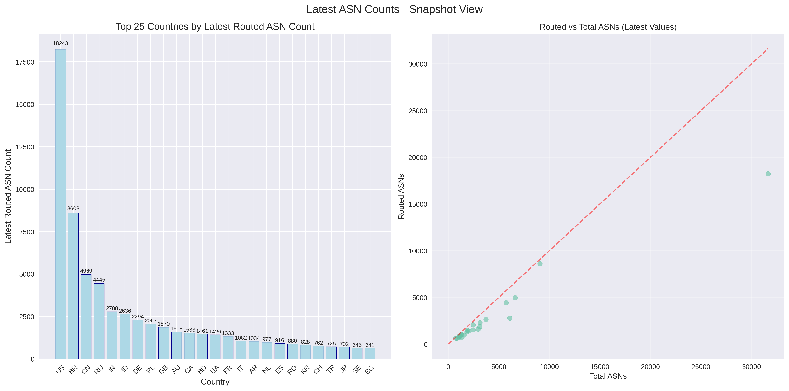
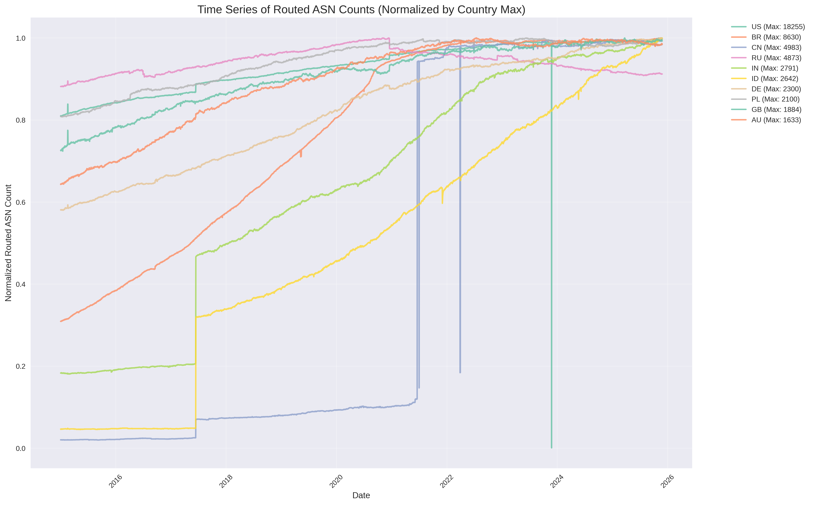
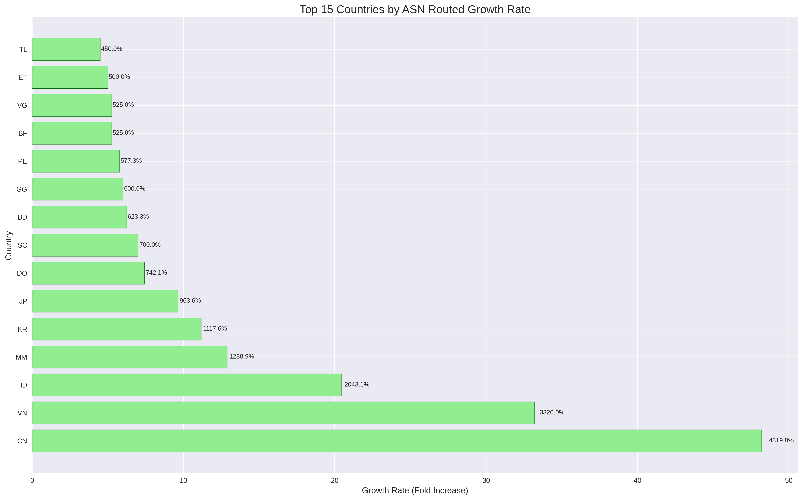
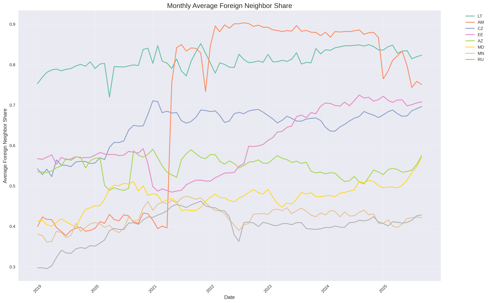
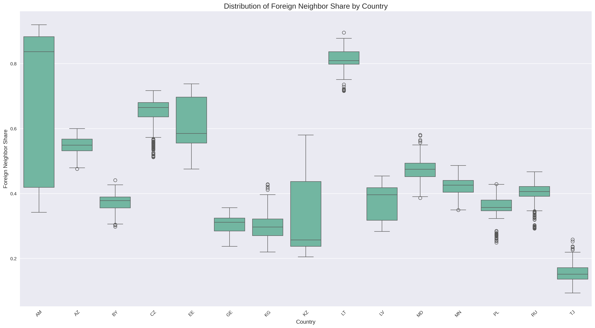
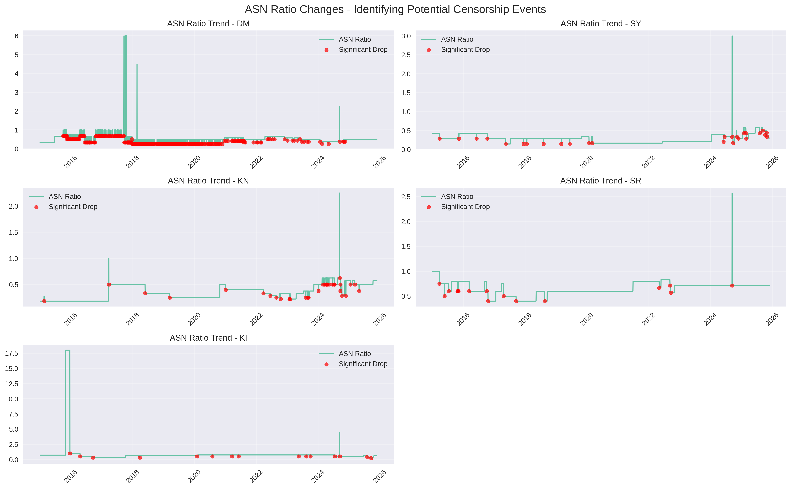
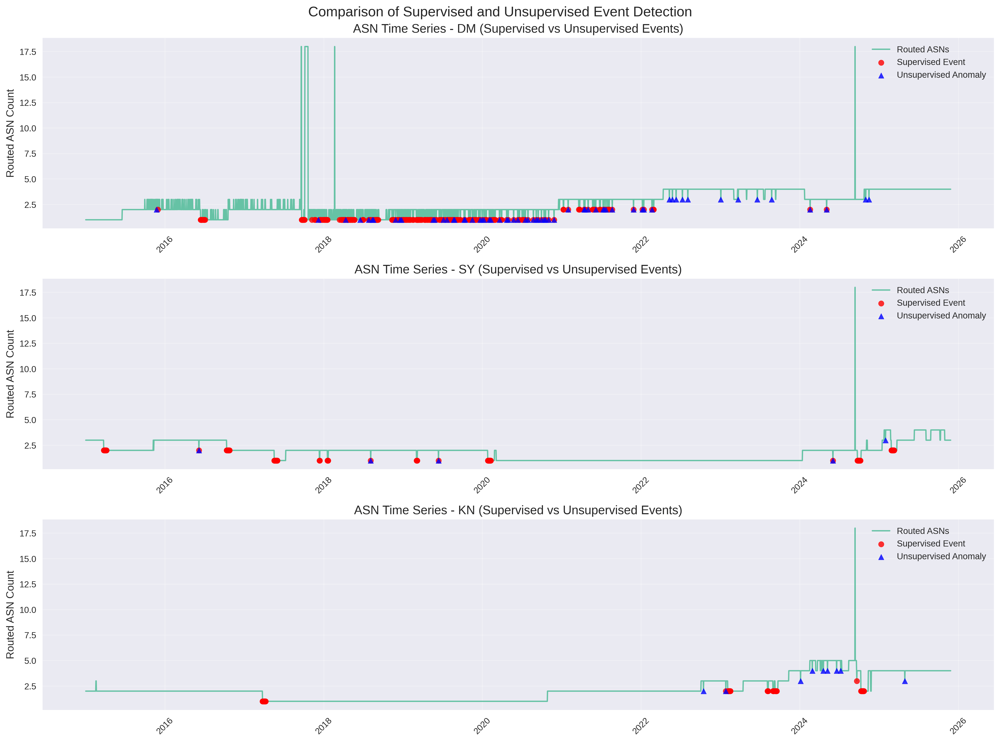

# Autonomous system numbers based internet censorship detection

## Using machine learning to identify network disruptions

---

## Project Overview

### Goal
- Detect internet potential censorship events using Autonomous System Number (ASN) data
- Apply both supervised and unsupervised machine learning approaches

### Data Sources
- RIPE API https://www.ripe.net/
  - RIPE NCC is the regional Internet registry for Europe, the Middle East, and parts of Central Asia

---


- An autonomous system (AS) is a very large network or group of networks with a single routing policy.
- In a simplified case it is a network of a single internet provider or company serving traffic (e.g. AWS and Cloudflare each has several ASs at least).
- AS can be routed (serve traffic), or only registered (not in work)
- AS can be connected to other inland ASs or to foreign ASs

---



---



---



---



---



---

## Machine Learning

### Feature Engineering
- Created `asn_censorship_indicator` based on significant ASN count drops
- Calculated connectivity metrics including foreign neighbor share

### Models
- Logistic Regression
- Random Forest Classifier
- Time Series Autoencoder for anomaly detection
```
┏━━━━━━━━━━━━━━━━━━━━━━━━━━━━━━━━━━━━━━┳━━━━━━━━━━━━━━━━━━━━━━━━━━━━━┳━━━━━━━━━━━━━━━━━┓
┃ Layer (type)                         ┃ Output Shape                ┃         Param # ┃
┡━━━━━━━━━━━━━━━━━━━━━━━━━━━━━━━━━━━━━━╇━━━━━━━━━━━━━━━━━━━━━━━━━━━━━╇━━━━━━━━━━━━━━━━━┩
│ lstm (LSTM)                          │ (None, 30, 64)              │          17,152 │
├──────────────────────────────────────┼─────────────────────────────┼─────────────────┤
│ lstm_1 (LSTM)                        │ (None, 32)                  │          12,416 │
├──────────────────────────────────────┼─────────────────────────────┼─────────────────┤
│ repeat_vector (RepeatVector)         │ (None, 30, 32)              │               0 │
├──────────────────────────────────────┼─────────────────────────────┼─────────────────┤
│ lstm_2 (LSTM)                        │ (None, 30, 32)              │           8,320 │
├──────────────────────────────────────┼─────────────────────────────┼─────────────────┤
│ lstm_3 (LSTM)                        │ (None, 30, 64)              │          24,832 │
├──────────────────────────────────────┼─────────────────────────────┼─────────────────┤
│ time_distributed (TimeDistributed)   │ (None, 30, 2)               │             130 │
└──────────────────────────────────────┴─────────────────────────────┴─────────────────┘
 ```

---

## Key Findings

### Potential censorship events detected
- **Total Events**: 1,367 potential censorship events
- **Affected Countries**: 75 countries
- **Top Country**: Dominica (DM) with 289 events

### Top Countries
1. Dominica (DM) - 289 events
2. Syria (SY) - Significant events  
3. Saint Kitts and Nevis (KN) - Significant events
4. Suriname (SR) - Significant events
5. Kiribati (KI) - Significant events

---

## Supervised vs Unsupervised Comparison

### Method Comparison
- *Supervised*: 1,367 events detected using labeled patterns
- *Unsupervised*: 87 anomalies detected using statistical methods
- *Overlap*: 63 events detected by both methods (4.61% overlap)

---



---



---

## Results Summary

### Key Insights
- Different detection methods identify complementary event patterns
- ASN data provides valuable insights into network disruptions
- Many significant drop in ASN are small numbers effect

---

## Conclusion

### Future Work
- Handle small countries
- Cross-reference with known censorship events
- Refine unsupervised anomaly detection algorithms
- Apply to real-time monitoring systems
